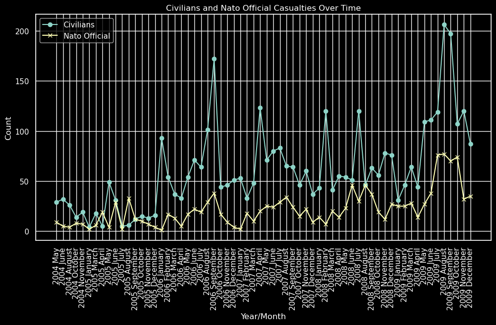

<!-- Example: index.md or README.md -->
# Welcome to our website!

## Group members are:
- Charlotte Schmitt
- Bianca Zordan
- Rosanna Meijer
- Jaap Wittenberg
- Antoine Lenweiter

---
WEEK 2
---

### Civilians and NATO Casualties Line Plot, per month

From May 2004 to December 2009, over 4000 civilians were killed in Afghanistan.  
The plot below shows the difference between the number of deaths per month for civilians and NATO forces.

---

### Total Casualties Bar Graph

The graph below shows the casualties of civilians and Afghan Forces combined, per month

The data used for the figures above is part of Wikileaks' Afghanistan War Logs.

---
WEEK 3
---

### Book Ratings Scatterplot

---

### Book Ratings Bar Graph

---

### Book Rating Boxplot

---

### Moran Plot

<!-- Center the content -->

